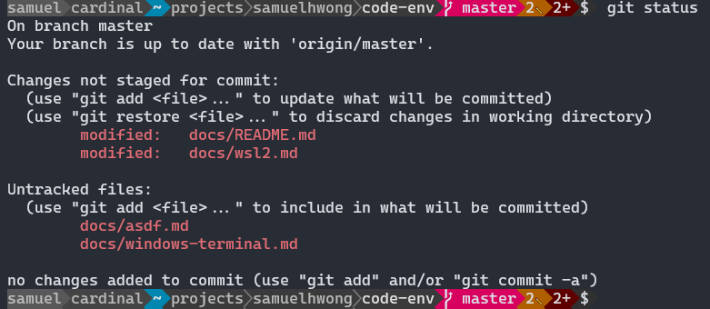

# Windows Terminal

## Download

* [Windows Terminal via Store](https://www.microsoft.com/store/apps/9n0dx20hk701)
* [GitHub](https://github.com/microsoft/terminal)

## How to get rid of the terminal bell

The terminal bell dings every time bash does a partial completion, or I type an invalid `vim` command. It's dinging annoying. To disable it, we'll make a change to Terminal's [settings.json](../src/mnt/c/Users/samuel/AppData/Local/Packages/Microsoft.WindowsTerminal_8wekyb3d8bbwe/LocalState/settings.json).

```
"profiles": 
    {
        "defaults": {
            // Put settings here that you want to apply to all profiles
            "bellStyle": "none"
        },
    }
```

## How to change fonts

In [settings.json](../src/mnt/c/Users/samuel/AppData/Local/Packages/Microsoft.WindowsTerminal_8wekyb3d8bbwe/LocalState/settings.json):

```
    "profiles": 
    {
        "list": 
        [
            {
                "colorScheme": "One Half Dark",
                "fontFace": "Cascadia Code PL",
                "fontSize": 13,
                "guid": "{2c4de342-38b7-51cf-b940-2309a097f518}",
                "hidden": false,
                "name": "Ubuntu",
                "source": "Windows.Terminal.Wsl"
            }
        ]
    }
```


## Prettify the prompt



Reference: https://www.hanselman.com/blog/how-to-make-a-pretty-prompt-in-windows-terminal-with-powerline-nerd-fonts-cascadia-code-wsl-and-ohmyposh

Prettify the command line with powerline - https://github.com/justjanne/powerline-go

```
sudo apt install golang-go
go get -u github.com/justjanne/powerline-go
```

Add this to your [.bashrc](../src/.bashrc). You may already have a GOPATH so be aware.

```
export GOPATH=$HOME/go
function _update_ps1() {
    PS1="$($GOPATH/bin/powerline-go -condensed -error $?)"
}
if [ "$TERM" != "linux" ] && [ -f "$GOPATH/bin/powerline-go" ]; then
    PROMPT_COMMAND="_update_ps1; $PROMPT_COMMAND"
fi
```

Now get [Cascadia Code PL (Powerline)](https://github.com/microsoft/cascadia-code/releases). This will remove the funky squares and weird symbols:

```
"fontFace":  "Cascadia Code PL"
```

Installing the TTF is recommended for Windows.