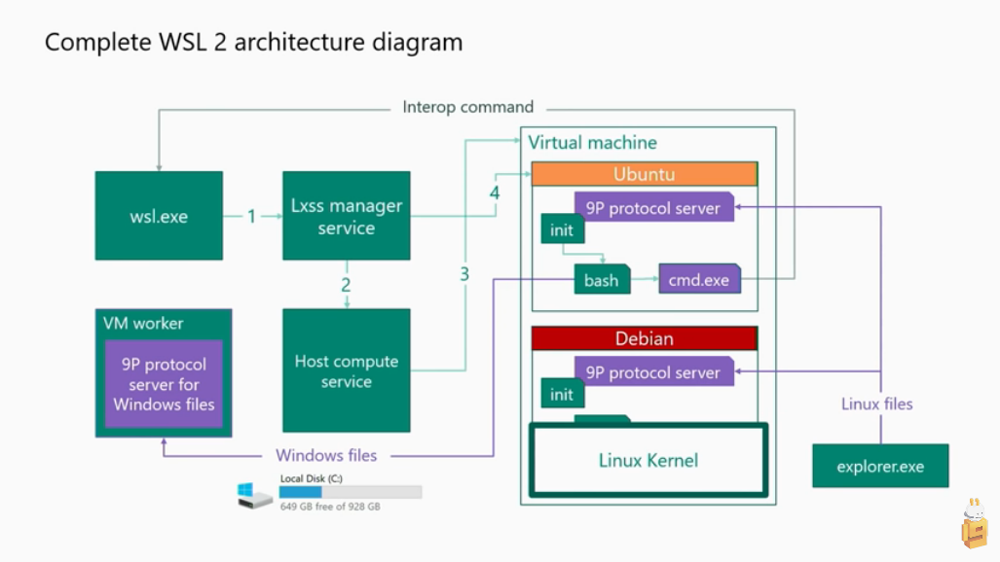

# WSL2

## What is WSL2?

Windows Subsystem for Linux. It is a lightweight "utility" VM created by Microsoft to enable a Linux-like environment on Windows.

WSL2 requires Hyper-V. Turning on Hyper-V prevents VirtualBox from running (with any semblance of speed and sanity).

## Installing WSL2

Reference: https://www.omgubuntu.co.uk/how-to-install-wsl2-on-windows-10

Some manual steps will allow you to run WSL2 without being on an Insiders Windows build.

## How to get rid of the dang terminal bell

The terminal bell dings every time bash does a partial completion, or I type an invalid `vim` command. It's dinging annoying. To disable it, we'll make a change to Terminal's [settings.json](../src/mnt/c/Users/samuel/AppData/Local/Packages/Microsoft.WindowsTerminal_8wekyb3d8bbwe/LocalState/settings.json).

## Dual-booting Hyper-V on/off

TODO
